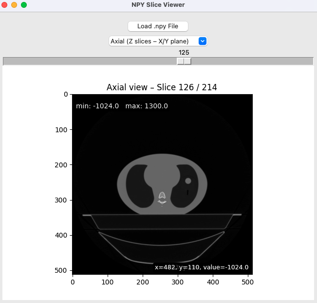
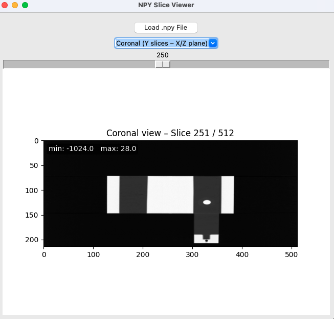
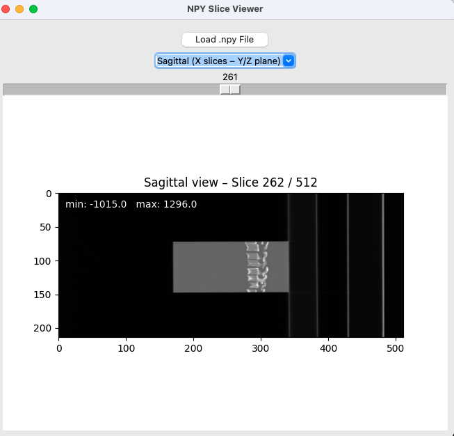

# NPY Viewer

A lightweight, interactive GUI tool to explore `.npy` 2D/3D medical image volumes in axial, sagittal, and coronal planes using Python and Matplotlib.


## Rationale & Motivation

When developing machine learning models on medical imaging data in Python, the [`.npy` format](https://numpy.org/devdocs/reference/generated/numpy.lib.format.html) becomes essential.  
While DICOM is the clinical standard for storing and exchanging medical images, deep learning models require direct access to numerical arrays — and [`NumPy`](https://numpy.org/) arrays (`.npy`) are the de facto standard for this purpose.

However, this flexibility comes with a challenge: most general-purpose medical image viewers (e.g., [Mango](https://mangoviewer.com/), [ImageJ](https://imagej.net/ij/)) do not support `.npy` files.  
This creates a blind spot in the pipeline. Before training any model, it is crucial to visually inspect the input data.  
Any preprocessing error — such as shape mismatches, intensity clipping, or misaligned slices — can compromise the training process.

**`npy_viewer` was created to fill this gap.**

This lightweight and intuitive GUI allows for quick visualization of 2D and 3D `.npy` medical images.  
It supports navigation along the three anatomical planes — axial, coronal, and sagittal — with mouse scroll interaction, pixel value overlays, and real-time min/max statistics per slice.  
With `npy_viewer`, you can verify your datasets in seconds before launching model training — no conversion, no fuss.

### Example Views

**Axial view**



**Coronal view**



**Sagittal view**



# Benefits
- No need to convert `.npy` → DICOM/NIfTI
- Minimal dependencies: [`matplotlib`](https://matplotlib.org/), [`tkinter`](https://docs.python.org/3/library/tkinter.html)
- Fast, platform-independent launch via `python gui.py`
- Designed for deep learning workflows using [`Python`](https://www.python.org/)

## Installation
### 1. Clone the repository

```bash
git clone https://github.com/lorenzomarini96/npy_viewer.git
cd npy_viewer
```
### 2. Create a virtual environment (recommended)
```bash
python -m venv .venv
source .venv/bin/activate  # On Windows: .venv\Scripts\activate
```
### 3. Install dependencies and the package
```bash
pip install -r requirements.txt
pip install -e .
```
Or directly from GitHub:
```bash
pip install git+https://github.com/lorenzomarini96/npy_viewer.git
```
### Test your installation
After installation, verify that the package is working correctly:
```bash
# Optional: remove previous versions
pip uninstall npy_viewer

# Install in editable mode
pip install -e .

# To launch the GUI:
python gui.py
```
This will launch the GUI if everything is properly configured.

# Usage
After installing the package locally in editable mode, to launch the GUI viewer:

```bash
python gui.py
```

## Features

- Load .npy 2D or 3D image volumes
- Scroll through slices with slider
- Switch between axial / coronal / sagittal views
- Real-time display of pixel (x, y) and intensity value
- Overlay of slice min/max values

## Project Structure

```bash
├── README.md
├── gui.py
├── npy_viewer
│   ├── __init__.py
│   ├── __pycache__
│   │   ├── __init__.cpython-310.pyc
│   │   ├── main.cpython-310.pyc
│   │   ├── utils.cpython-310.pyc
│   │   └── viewer.cpython-310.pyc
│   ├── main.py
│   ├── utils.py
│   └── viewer.py
├── pyproject.toml
├── requirements.txt
├── setup.py
└── tests
    └── test_utils.py
```

# License
This project is licensed under the [GNU General Public License v3](https://www.gnu.org/licenses/gpl-3.0.en.html).  
You are free to use, modify, and redistribute it under the same license terms.